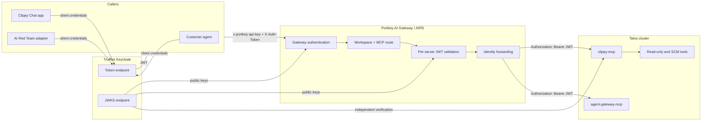
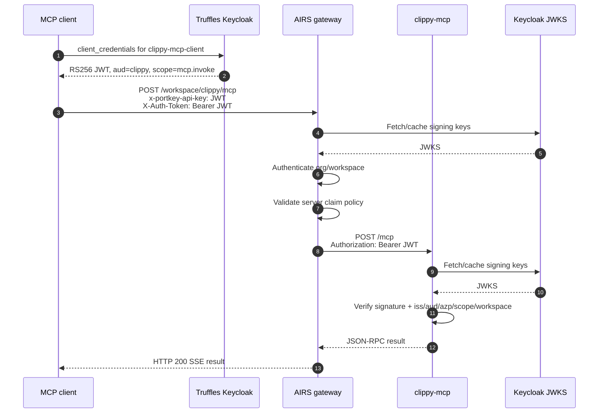
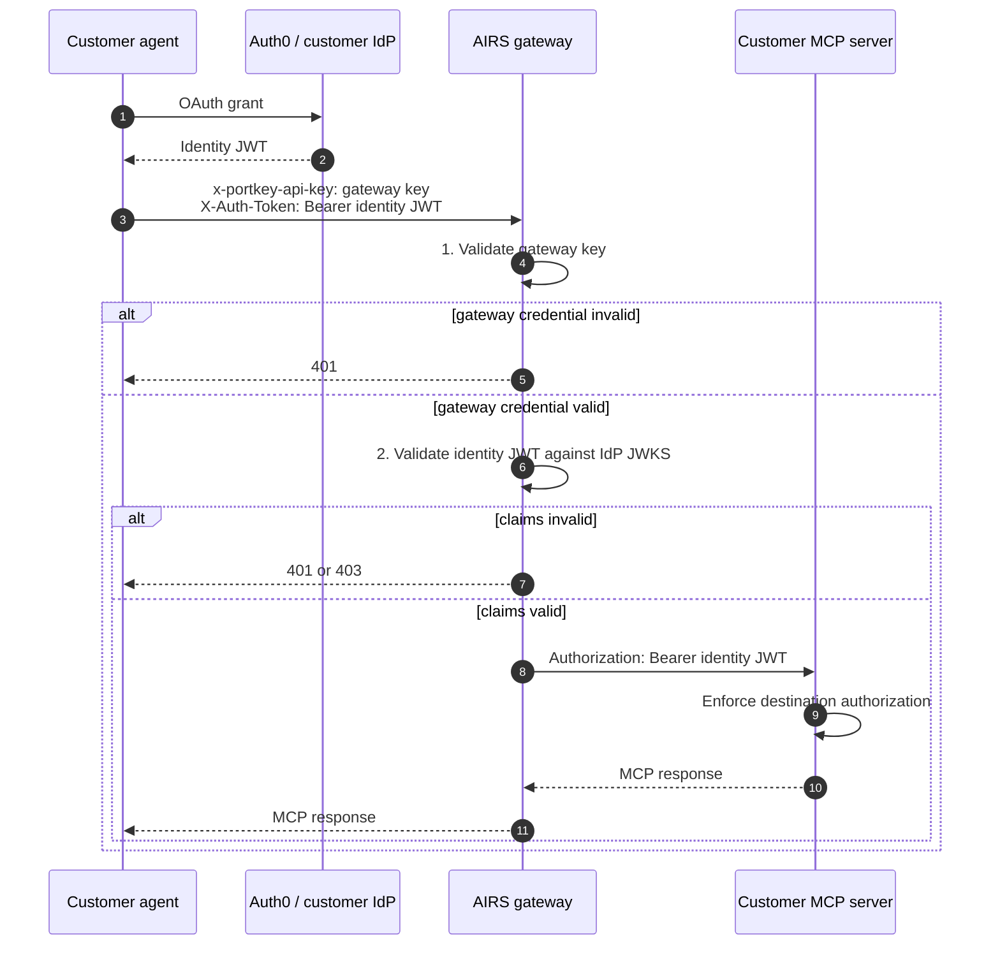
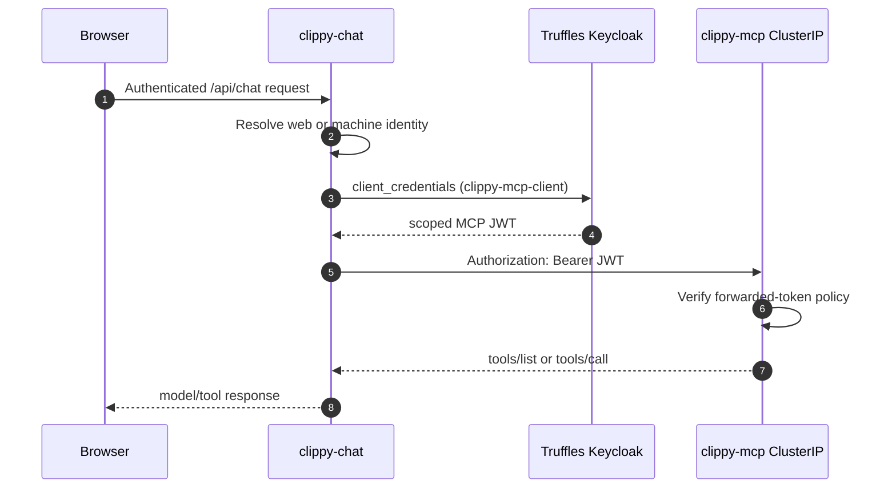
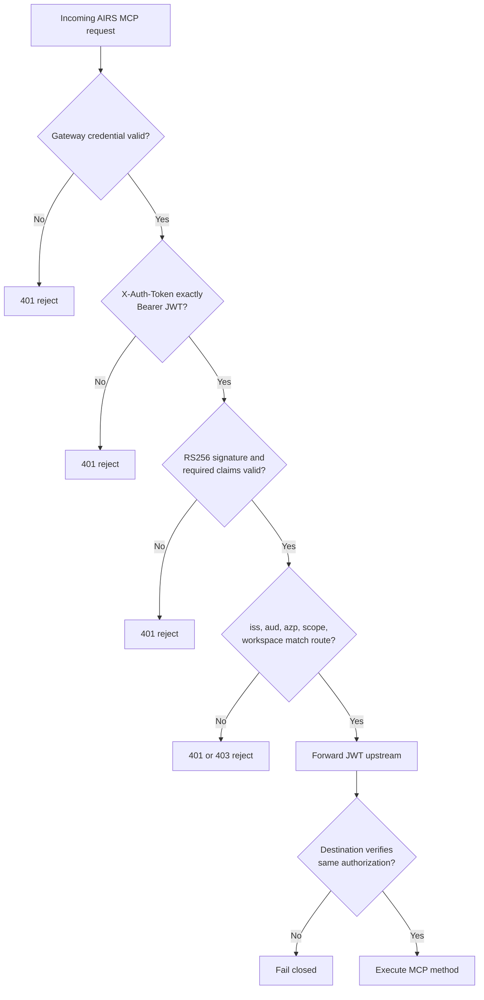

# AI Gateway and MCP architecture

## System topology

The public endpoint is AIRS. `clippy-mcp` is a ClusterIP-only service: AIRS reaches it through
the registered upstream, but there is no public Kubernetes ingress. The application can call it
directly inside the cluster and mints its own `clippy-mcp-client` token.

## Org-level JWKS request

This is the production external request. The JWT has both Portkey organization/workspace claims
and the Clippy permission claims.

There are two cryptographic validations of the identity token: at AIRS and at `clippy-mcp`.
The second check is deliberate defense in depth, not duplicate gateway authentication.

## Workspace key plus JWT Validator Guardrail

This is the customer pattern when the IdP token does not carry Portkey organization claims.

The two header values are different in this mode. `$JWT` is not a gateway key unless it carries
the configured Portkey organization claims.

## Clippy Chat internal request

The web app does not send its browser/user session token to MCP. The server-side application
mints a scoped machine token, caches it until 30 seconds before expiry, and supplies it directly
to the internal MCP server.

## Authorization decision

## Trust boundaries

| Boundary | Trusted input | Rejected input |
| --- | --- | --- |
| Keycloak token endpoint | Registered confidential client and secret | Wrong/disabled client, wrong secret |
| AIRS org authentication | Gateway key or verified org-claim JWT | Missing/malformed/wrong-org credential |
| AIRS MCP registration | Token matching exact server policy | Wrong audience/client/scope/workspace |
| `clippy-mcp` | Forwarded RS256 bearer matching environment policy | Missing, duplicate, malformed, expired, or mismatched bearer |
| Tool layer | Authorized JSON-RPC method and validated arguments | Unknown method/tool or invalid arguments |

## Deployment ownership

| Component | Source of truth | Deployment |
| --- | --- | --- |
| Clippy app and MCP server | [Clippy Forgejo](https://git.cdot.io/cdot.io/clippy-chat) | Forgejo CI builds immutable Harbor images; Argo CD applies manifests |
| Keycloak realm/client projection | Talos cluster repository | Declarative stack projection and lifecycle scripts |
| AIRS and MCP registrations | Talos cluster repository | Helm/Argo plus guarded cutover scripts |
| Public Docusaurus docs | Clippy Forgejo, mirrored to GitHub | GitHub Pages workflow on mirrored `main` |

For exact values and test expectations, continue to [E2E testing](./e2e-testing).
