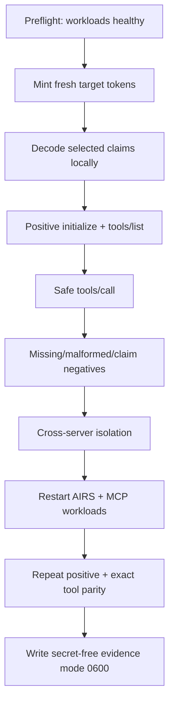
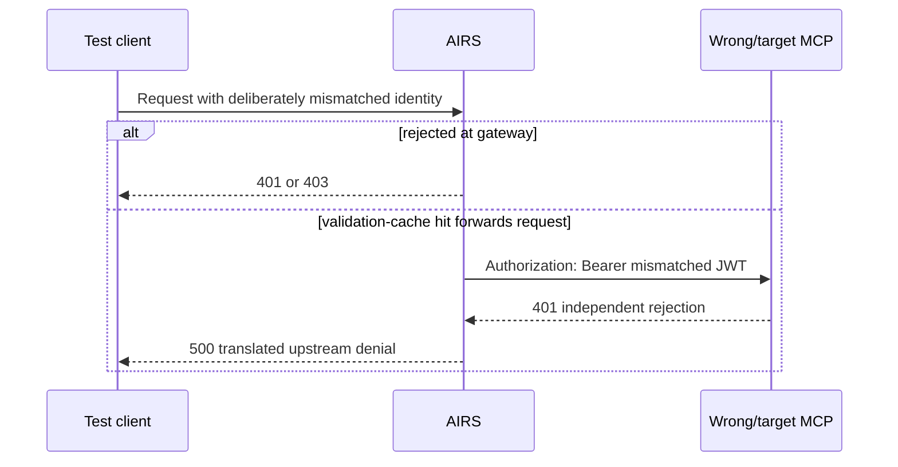
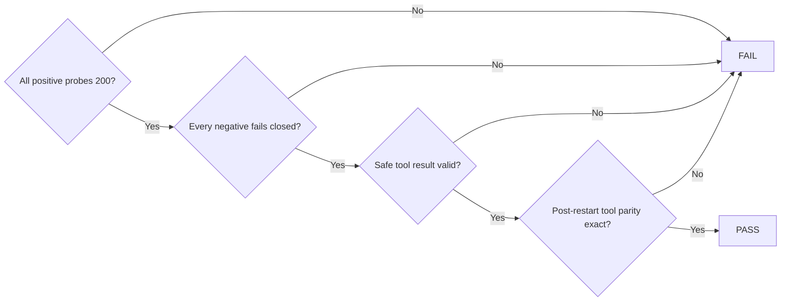

# End-to-end security test plan

Run this plan from a trusted workstation with cluster access. It mints short-lived production
tokens and calls public AIRS endpoints. Never paste a client secret or JWT into a command-line
argument, shell trace, ticket, chat, or evidence file.

:::danger Safe tool only
Use `get_current_datetime` for an execution proof. Do not call `scm_config`: it changes live
Strata Cloud Manager candidate configuration.
:::

## Test workflow



## Prerequisites

- `kubectl`, `curl`, and `jq` installed.
- Kubernetes context is explicitly `talos`.
- `clippy-mcp-client` enabled in `truffles`; its `agent-mesh` predecessor disabled.
- `clippy-chat` 2/2, `clippy-mcp` 1/1, AIRS 2/2, and Agent Gateway MCP 2/2 Ready.
- Shell history disabled for the session if manual secret entry is necessary.
- No `set -x`.

```bash title="Workload preflight"
test "$(kubectl config current-context)" = talos
kubectl -n clippy get deploy clippy-chat clippy-mcp
kubectl -n airs-gw get deploy airs-gw
kubectl -n agent-gateway get deploy agent-gateway-mcp
```

## 1. Mint a Clippy token safely

This example reads the reconciled Kubernetes Secret. Secret and JWT values stay in shell memory
and stdin; only non-secret token metadata is printed.

```bash title="Mint a scoped token"
SECRET_JSON="$(kubectl -n clippy get secret clippy-mcp-client -o json)"
CLIENT_ID="$(jq -er '.data.MCP_CLIENT_ID | @base64d' <<<"$SECRET_JSON")"
CLIENT_SECRET="$(jq -er '.data.MCP_CLIENT_SECRET | @base64d' <<<"$SECRET_JSON")"
TOKEN_URL="$(jq -er '.data.MCP_TOKEN_URL | @base64d' <<<"$SECRET_JSON")"
unset SECRET_JSON

CLIENT_ID_FORM="$(printf '%s' "$CLIENT_ID" | jq -sRr @uri)"
CLIENT_SECRET_FORM="$(printf '%s' "$CLIENT_SECRET" | jq -sRr @uri)"
TOKEN_RESPONSE="$(
  printf 'grant_type=client_credentials&client_id=%s&client_secret=%s' \
    "$CLIENT_ID_FORM" "$CLIENT_SECRET_FORM" |
  curl -fsS --connect-timeout 10 --max-time 30 "$TOKEN_URL" \
    -H 'content-type: application/x-www-form-urlencoded' --data-binary @-
)"
JWT="$(jq -er '.access_token' <<<"$TOKEN_RESPONSE")"
jq '{access_token:"[REDACTED JWT]",token_type,expires_in,scope}' <<<"$TOKEN_RESPONSE"
unset CLIENT_SECRET CLIENT_SECRET_FORM TOKEN_RESPONSE
```

Expected metadata in production:

```json
{
  "access_token": "[REDACTED JWT]",
  "token_type": "Bearer",
  "expires_in": 3600,
  "scope": "mcp.invoke"
}
```

Decode only selected non-secret claims for inspection. A JWT is still a credential; do not print
or persist the encoded value.

```bash title="Inspect selected claims"
jq -Rr '
  split(".")[1] | gsub("-"; "+") | gsub("_"; "/") |
  . + ("=" * ((4 - (length % 4)) % 4)) | @base64d | fromjson |
  {iss,aud,azp,scope,portkey_oid,portkey_workspace,exp}
' <<<"$JWT"
```

Verify the values against the [production policy](./overview#production-policy).

## 2. Initialize through AIRS

```bash title="MCP initialize"
MCP_URL='https://mcp-airs.cdot.io/ws-produc-985697/clippy/mcp'
INITIALIZE='{"jsonrpc":"2.0","id":"review-init","method":"initialize","params":{"protocolVersion":"2025-03-26","capabilities":{},"clientInfo":{"name":"ai-security-review","version":"1.0"}}}'

{
  printf 'x-portkey-api-key: %s\n' "$JWT"
  printf 'X-Auth-Token: Bearer %s\n' "$JWT"
} | curl -fsS --connect-timeout 10 --max-time 30 "$MCP_URL" \
  -H @- -H 'content-type: application/json' \
  -H 'accept: application/json, text/event-stream' \
  --data "$INITIALIZE"
```

Expected: HTTP `200`, JSON-RPC result, protocol `2025-03-26`, server `clippy-tools`.

## 3. List exact tools

```bash title="MCP tools/list"
TOOLS='{"jsonrpc":"2.0","id":"review-tools","method":"tools/list","params":{}}'
{
  printf 'x-portkey-api-key: %s\n' "$JWT"
  printf 'X-Auth-Token: Bearer %s\n' "$JWT"
} | curl -fsS --connect-timeout 10 --max-time 30 "$MCP_URL" \
  -H @- -H 'content-type: application/json' \
  -H 'accept: application/json, text/event-stream' \
  --data "$TOOLS"
```

Expected exact names, sorted:

```text
get_current_datetime
get_daily_news
get_mlb_scores
get_weather
polymarket_bets
scm_config
web_search
```

An empty list, changed list, non-200 response, malformed SSE, or JSON-RPC error fails the test.

## 4. Execute one safe tool

```bash title="MCP tools/call"
CALL='{"jsonrpc":"2.0","id":"review-call","method":"tools/call","params":{"name":"get_current_datetime","arguments":{}}}'
{
  printf 'x-portkey-api-key: %s\n' "$JWT"
  printf 'X-Auth-Token: Bearer %s\n' "$JWT"
} | curl -fsS --connect-timeout 10 --max-time 30 "$MCP_URL" \
  -H @- -H 'content-type: application/json' \
  -H 'accept: application/json, text/event-stream' \
  --data "$CALL"
```

Expected: HTTP `200`, a `result.content` text block with date/time/timezone, and
`isError: false`.

## 5. Workspace-key variant

When testing a JWT Validator Guardrail instead of Org-level JWKS, keep the credentials distinct:

```bash title="Workspace key plus identity JWT"
{
  printf 'x-portkey-api-key: %s\n' "$GATEWAY_SECURITY_KEY"
  printf 'X-Auth-Token: Bearer %s\n' "$JWT"
} | curl -fsS --connect-timeout 10 --max-time 30 "$MCP_URL" \
  -H @- -H 'content-type: application/json' \
  -H 'accept: application/json, text/event-stream' \
  --data "$INITIALIZE"
```

`$GATEWAY_SECURITY_KEY` and `$JWT` must not be assumed equal.

## 6. Negative matrix

Run each case with a fresh, purpose-built token where applicable. Accept only `401` or `403`.
Do not treat `404`, transport failure, timeout, or empty response as authorization success.

| Probe | Mutation | Expected |
| --- | --- | --- |
| Missing all | Omit both headers | `401` |
| Missing gateway | Omit `x-portkey-api-key` | `401` |
| Missing identity | Omit `X-Auth-Token` | `401` |
| Wrong gateway | Put malformed value in gateway header | `401` |
| Malformed identity | `X-Auth-Token: Bearer malformed.jwt` | `401` |
| Wrong audience | Signed inference identity against Clippy/Agent route | `401` |
| Wrong scope | Signed provisioner identity lacking `mcp.invoke` | `401` |
| Wrong workspace | Correct identity against `/wrong-workspace/...` | `403` |
| Inference to Clippy | `completions.write` token against Clippy | `401` |
| Agent to Clippy | Agent identity against Clippy | `401`, or cached fail-closed `500` |
| Clippy to Agent | Clippy identity against Agent Gateway | `401`, or cached fail-closed `500` |
| Clippy to inference | Clippy identity against `/v1/chat/completions` | `403` |

The signed negative probes are composite end-to-end denials. Exact individual claim enforcement
is also covered by registration-projection tests and `clippy-mcp` unit tests.



## 7. Restart and parity

This is mutating and belongs in an approved production test window:

```bash title="Restart verification"
kubectl -n airs-gw rollout restart deployment/airs-gw
kubectl -n airs-gw rollout status deployment/airs-gw --timeout=5m
kubectl -n agent-gateway rollout restart deployment/agent-gateway-mcp
kubectl -n agent-gateway rollout status deployment/agent-gateway-mcp --timeout=5m
```

Within a strict 60-second readiness deadline, repeat initialize and tools/list for both MCP
servers. Retry only transport errors and `500`, `502`, `503`, or `504`; fail immediately on
`401`, `403`, malformed `200`, or empty tools. Pre/post tool arrays must be exactly equal.

## Pass/fail workflow



## Evidence rules

- Write only status codes, selected non-secret claims, tool names, timestamps, and image digests.
- Set evidence mode to `0600`; write atomically.
- Mark evidence `in_progress` before the first probe so a prior pass cannot be reused.
- Never record client secrets, gateway keys, JWTs, `Set-Cookie`, or full Kubernetes Secrets.
- Link evidence to the exact Forgejo commit and deployment image digest.
- Record any cached fail-closed `500` separately from a direct `401`/`403`.

Unset all credentials when finished:

```bash
unset JWT CLIENT_ID CLIENT_ID_FORM TOKEN_URL GATEWAY_SECURITY_KEY
```
